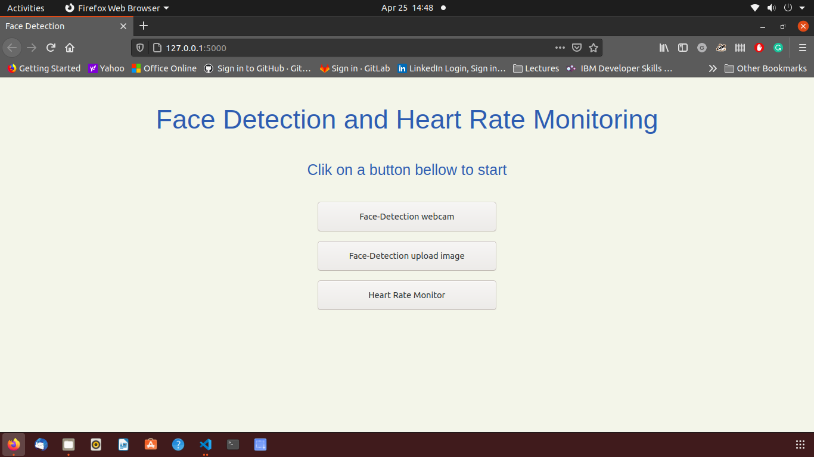
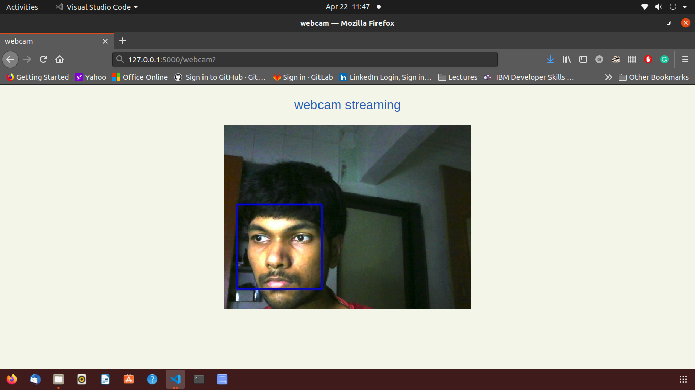
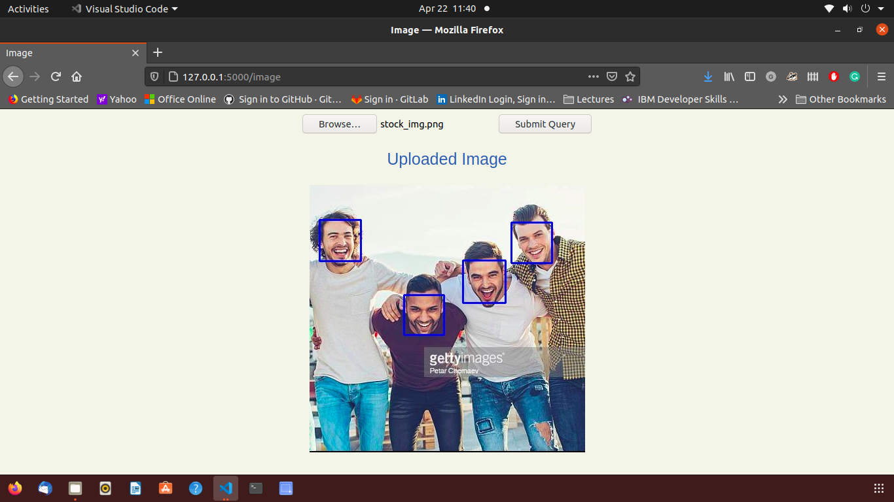
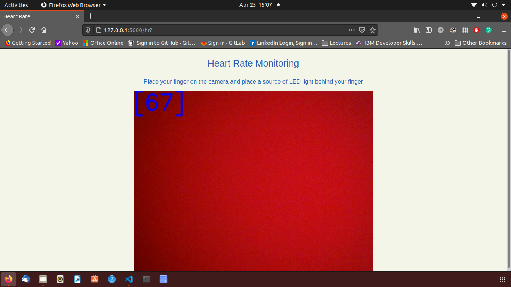

# Face-Detection and Heart Rate Monitoring
## Steps to run the program
**install dependencies**
This program requires python 3.6 to run
install pip if not already installed

1. pip install flask
2. pip install opencv-python
3. pip install sklearn

use pip3 instead of pip if you have pip version 3

**Run the program**
1. git clone https://github.com/debankur-ghosh/Face-Detection-and-Heart-Rate-Monitoring.git
2. cd Face-Detection
3. FLASK_APP=app.py
4. flask run
---
## Follow the bellow steps if you're using anaconda
1. conda create --name flsk python=3.6 -y
2. conda activate flsk
3. git clone https://github.com/debankur-ghosh/Face-Detection-and-Heart-Rate-Monitoring.git
4. cd Face-Detection-and-Heart-Rate-Monitoring
5. pip install flask
6. pip install opencv-python
7. pip install sklearn
8. FLASK_APP=app.py
9. flask run


# result 

**index page** 




**using webcam**




**using photo**
1. click `Browse`
2. select the photo from local directory
3. click `Submit Query` to obtain result



**Heart Rate Monitoring**
1. Place your finger on the camera and hold a source of LED light close to your finger nail




## Incase webcam page is not working or not showing output
edit line number 48 of app.py as shown below
edit the video capture index to 1

**change this**
```python
cam=cv2.VideoCapture(0)  
    while(cam.isOpened()):    
        ret, frame=cam.read()

        if not ret:
            frame= cv2.VideoCapture(0) 
  ```          
            
            
**to this**
``` python
cam=cv2.VideoCapture(1)   
    while(cam.isOpened()):    
        ret, frame=cam.read()

        if not ret:
            frame= cv2.VideoCapture(1) 
            continue ```


